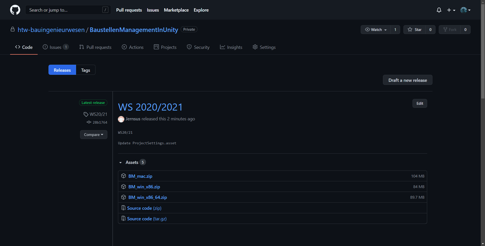

# **Navigation**  

* [Home](Home.md)  
* [Projektbeschreibung](Projektbeschreibung.md)  <!-- Passend zur Readme (gleich?) -->
* [Abschlussprotokoll](Abschlussprotokoll.md)

**[Anwender](Anwender.md)**  <!-- Unterscheidung der Doku zwischen Anw und Dev -->
* [Getting Started](GettingStartedUser.md)
* [Hauptmenü](Hauptmenü.md)  
* [Baustelle](Baustelle.md)  
  * [Bewegen der Kamera](Bewegen-der-Kamera.md)
  * [Objekte platzieren](Objekte-platzieren.md)
  * [Objekte verändern](Objekte-verändern.md)
  * [Visualisieren](Fahrzeugdaten-visualisieren.md)
  * [Polieransicht](Polieransicht.md)
* [Speichern/Laden](Speichern-und-Laden.md)
* [Modelle importieren](Modelle-importieren.md)
* [Tastenkürzel](Tastenkürzel.md)
* [GitHub](Github.md)

***

**[Entwickler](Entwickler.md)**  
* [Getting Started](GettingStartedDev.md)
* [Prefabs hinzufügen](Prefabs-hinzufügen.md)
* [Overview](Overview.md)
* [Betrachter Anwendung](Betrachter-Anwendung.md)
* [Anwendung bauen](Anwendung-bauen.md)
* Visualisierung   
  * [Datenbank](Datenbank.md)
  * [DataInterface](DataInterface.md)

# Anwendung bauen 

Um einen Build der Anwendung zu erzeugen muss das Projekt mit dem Unity Editor geöffnet werden. Im Menü unter `File` den Eintrag `Build Settings...` auswählen. Die Einstellungen sind von der Zielplatform und der Architektur abhängig. Bei einem Windows 64Bit Betriebssystem muss als Target Platform `windows` ausgewählt werden und als Architektur `x86_64`. Mit `Build` wird die Anwendung erzeugt, sobald man im darauf folgenden Fenster ein Zielordner angegeben hat.  

  

Wenn der Build abgeschlossen ist, muss man in dem Build-Ordner den Ordner `ImportIFC` hinzufügen. Diesen findet man in der Root des Projektes. Dieser Ordner kümmert sich um den Runtime-Import.
 

 

# Github Release
Um auf Github ein Release zu veröffentlichen, muss man auf der Github Seite des Projektes auf `Releases` klicken.

 

Anschließend kann man unter `Draft new release` ein neues Release-Build veröffentlichen.

 

Hier fügt man nun die `.zip` Dateien an die man zuvor als Build erstellt hat.

 

 
