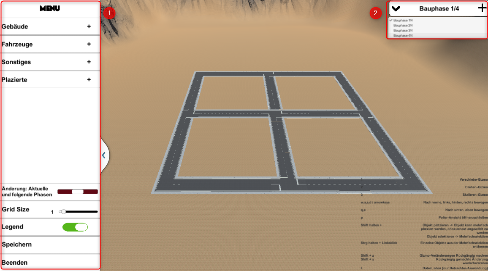
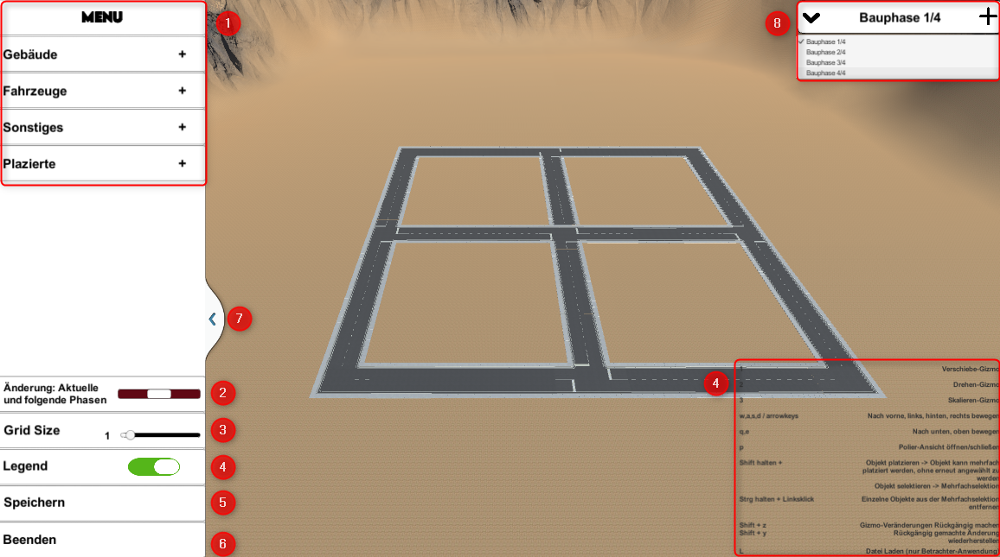
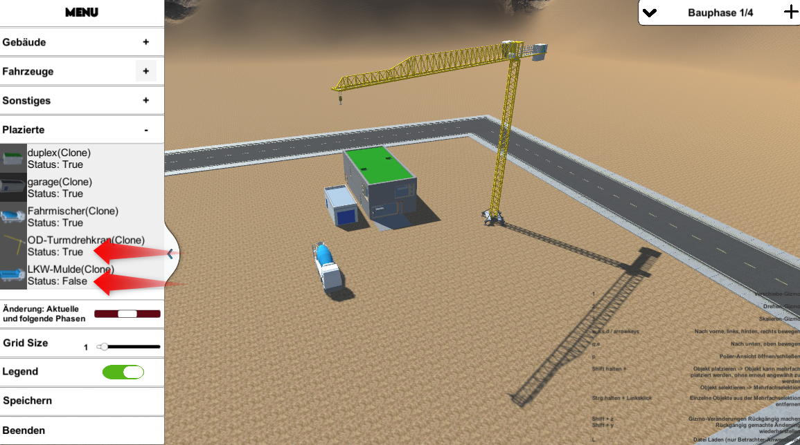
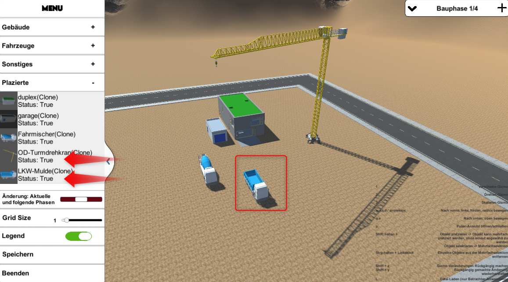
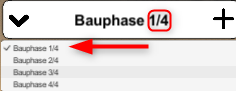
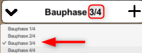

# **Navigation**  

* [Home](Home.md)  
* [Projektbeschreibung](Projektbeschreibung.md)  <!-- Passend zur Readme (gleich?) -->
* [Abschlussprotokoll](Abschlussprotokoll.md)

**[Anwender](Anwender.md)**  <!-- Unterscheidung der Doku zwischen Anw und Dev -->
* [Getting Started](GettingStartedUser.md)
* [Hauptmenü](Hauptmenü.md)  
* [Baustelle](Baustelle.md)  
  * [Bewegen der Kamera](Bewegen-der-Kamera.md)
  * [Objekte platzieren](Objekte-platzieren.md)
  * [Objekte verändern](Objekte-verändern.md)
  * [Visualisieren](Fahrzeugdaten-visualisieren.md)
  * [Polieransicht](Polieransicht.md)
* [Speichern/Laden](Speichern-und-Laden.md)
* [Modelle importieren](Modelle-importieren.md)
* [Tastenkürzel](Tastenkürzel.md)
* [GitHub](Github.md)

***

**[Entwickler](Entwickler.md)**  
* [Getting Started](GettingStartedDev.md)
* [Prefabs hinzufügen](Prefabs-hinzufügen.md)
* [Overview](Overview.md)
* [Betrachter Anwendung](Betrachter-Anwendung.md)
* [Anwendung bauen](Anwendung-bauen.md)
* Visualisierung   
  * [Datenbank](Datenbank.md)
  * [DataInterface](DataInterface.md)

# Übersicht Benutzeroberfläche
Die Benutzeroberfläche der Baustelle besteht aus zwei Hauptkomponenten:
1. Menü/Objektübersicht
2. Phasenübersicht
   



***

## 1. Menü
Das Menü bietet folgende Möglichkeiten:
1. Der Objektauswahl
     * Gebäude
     * Fahrzeuge
     * Sonstige
     * Platzierte
2. Den Modus umschalten, in dem neue Objekte hinzugefügt beziehungsweise geändert werden.
     * ```Vollständig```: Objekte werden in allen Phasen hinzugefügt/verändert.
     * ```Aktuelle und folgende Phasen```: Objekte werden in der aktuellen und allen nachfolgenden Phasen hinzugefügt/verändert. 
     * ```Nur aktuelle Phase```: Objekte werden nur in der aktuelle Phase hinzugefügt/verändert.
     * Änderungen am `Visibility-Status(true/false)` der `Platziert-Objekte` werden nicht in den Phasen übernommen
3. Die Einstellung der Grid-Größe
4. Legende an/aus 
5. Die aktuelle Baustelle ````Speichern````
6. Die Anwendung ```Beenden```  
7. Das Main Menü einklappen/ausklappen
8. Bauphasenübersicht



***

## 2. Objektübersicht
Die Objektübersicht besteht aus vier Tabs:
* dem ```Gebäude```-Tab,
  * in dem alle in der Anwendung importierten Gebäude angezeigt werden.
* dem ```Fahrzeuge```-Tab,
  * in dem alle in der Anwendung importierten Fahrzeuge angezeigt werden.
* dem ```Sonstiges```-Tab,
  * in dem alle sonstigen importierten Objekte angezeigt werden (Wege, Zäune, ...).
* dem ```Alle platzierten Objekte```-Tab
  * in dem alle platizeren Objekte mit ihrem Status(true/false) in der aktuellen Phase angezeigt werden
  * mit dem in einer Phase inaktive Objekte wieder eingeblendet werden können.

```Alle platzierten Objekte```-Tab Beispiel:  
  

***

## 3. Phasenübersicht
1. Die Phasenübersicht zeigt an, in welcher Bauphase (oder Bauabschnitt) die Baustelle gerade dargestellt wird und wie viele Phasen aktuell existieren.
- Die Phasen lassen sich mit ```↓``` aufklappen.
    - Mit einem Klick auf eine Phase wird diese geladen.
- Eine neue Phase lässt sich mit ```+``` hinzufügen.
    - Hinweis:
    Die neue Phase wird immer in Abhängigkeit zu der aktuell ausgewählten Phase erstellt. Das heißt, wenn wir uns in der Phase `3/4` befinden und eine neue Phase erstellt wird, wird die Phase `3/4` kopiert und als `5/5` angefügt. 



