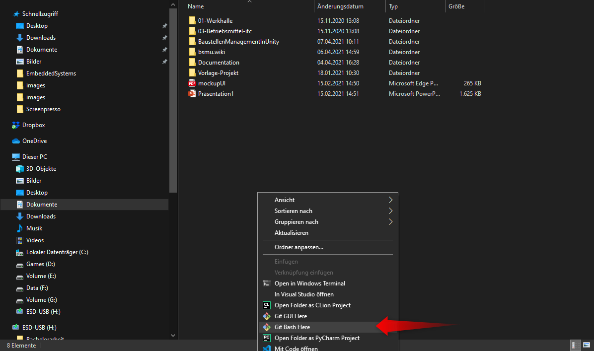
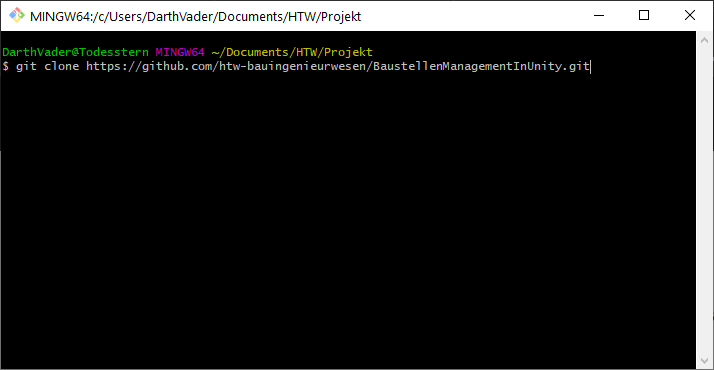
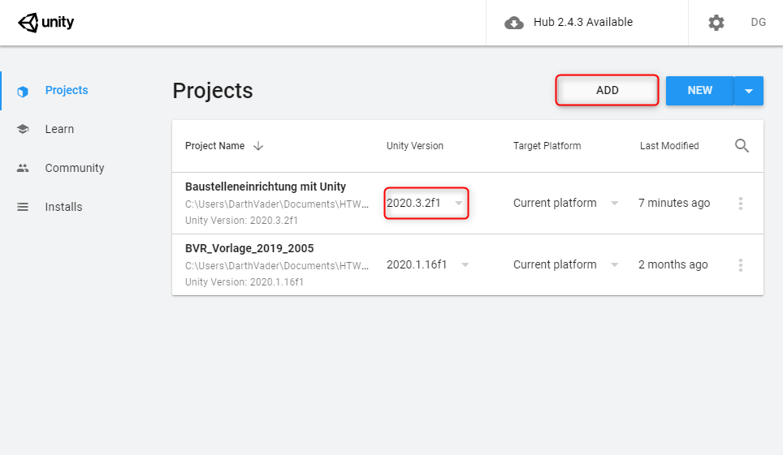
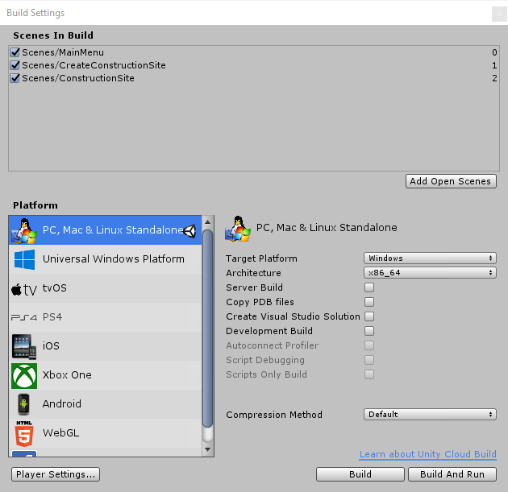

# **Navigation**  

* [Home](Home.md)  
* [Projektbeschreibung](Projektbeschreibung.md)  <!-- Passend zur Readme (gleich?) -->
* [Abschlussprotokoll](Abschlussprotokoll.md)

**[Anwender](Anwender.md)**  <!-- Unterscheidung der Doku zwischen Anw und Dev -->
* [Getting Started](GettingStartedUser.md)
* [Hauptmenü](Hauptmenü.md)  
* [Baustelle](Baustelle.md)  
  * [Bewegen der Kamera](Bewegen-der-Kamera.md)
  * [Objekte platzieren](Objekte-platzieren.md)
  * [Objekte verändern](Objekte-verändern.md)
  * [Visualisieren](Fahrzeugdaten-visualisieren.md)
  * [Polieransicht](Polieransicht.md)
* [Speichern/Laden](Speichern-und-Laden.md)
* [Modelle importieren](Modelle-importieren.md)
* [Tastenkürzel](Tastenkürzel.md)
* [GitHub](Github.md)

***

**[Entwickler](Entwickler.md)**  
* [Getting Started](GettingStartedDev.md)
* [Prefabs hinzufügen](Prefabs-hinzufügen.md)
* [Overview](Overview.md)
* [Betrachter Anwendung](Betrachter-Anwendung.md)
* [Anwendung bauen](Anwendung-bauen.md)
* Visualisierung   
  * [Datenbank](Datenbank.md)
  * [DataInterface](DataInterface.md)

# Hinweis zur Datenbank und dem Viewer-Branch
Im aktuellen LatestRelease des Semester 20/21 wurde weder der Datenbank-Branch noch der Viewer Branch bearbeitet. Die Anbindung an die Datenbank ist nachwievor vorhanden, da aber keine laufende Instanz zur Verfügung stand wurde dies in unseren Änderungen nicht beachtet. Die Datenbank sollte jedoch mit einigen wenigen Änderungen schnell zum laufen gebracht werden. Der Viewer-Branch ist mit den aktuellen Änderungen nicht kompatible und sollte vor Verwendung komplett überarbeitet werden.

# Getting Started
Dieser Guide soll beim schnellen Einstieg in die Anwendung helfen. Es werden alle Schritte vom erstmaligen clonen des Projektes bishin zum finalen Build Prozess bearbeitet.

## 1. Erstmaliges Clonen des Projektes
Um das Projekt auf den Rechner zu bekommen, können wir uns den aktuellen Master-Branch, lokal auf unseren Rechner kopieren. 
Dies lässt sich mit einem Befehl in der Git-Bash umsetzen. Wir öffnen den Zielordner und öffnen mit Rechtsklick das Kontextmenü. Hier wählen wir Git-Bash aus. 
`Hinweis: Dies ist nur Möglich, wenn Git auf dem Zielrechner installiert ist. Git kann unter folgendem Link heruntergeladen werden:` [GitDownload](https://git-scm.com/download/win)

  

Wenn sich nun die Git-Bash geöffnet hat, müssen wir das Kommando "`git clone https://github.com/htw-bauingenieurwesen/BaustellenManagementInUnity.git`" ausführen. Dies sorgt dafür das der aktuelle Master-Branch, lokal auf den Rechner kopiert wird.

  

## 2. Erstellen des Unity Projektes
Nachdem das Clonen des Projektes erfolgreich abgeschlossen wurde, müssen wir im Unity-Hub das Projekt hinzufügen. `Hinweis: Unity Hub kann unter folgendem Link heruntergeladen und mit der passenden Subscription(Student/Personal) verknüpft werden:` [UnityHub](https://store.unity.com/#plans-individual)

Um dem Hub nun ein Projekt zuzuweisen müssen wir auf den `ADD` Button klicken und im anschließenden Kontextmenü, den zuvor geclonten Ordner angeben. Anschließend müssen wir sicher gehen, dass das Projekt mit der Unity Version `2020.3.2f1` gestartet wird. Mit einem nachfolgenden Klick auf das Projekt wird dieses im Unity Editor geöffnet.

  

## 3. Bauen des Projektes

Um das Projekt nun zu bauen und eine fertige `.exe`-Datei zu erhalten, müssen wir im UnityEditor unter `File -> Build Settings` den Build Starten.
Die fertige `.exe`-Datei ist anschließend im Ordner des Projektes zu finden und kann z.B. als Verknüpfung zum Startbildschirm hinzugefügt werden.

  

## 4. Hinzufügen von neuen Modellen

Alle Informationen zum Hinzufügen neuer Modelle sind unter [Modelle importieren](Modelle-importieren.md) zu finden. 

## 5. Änderungen hinzufügen und bereitstellen

Um neue Objekte anderen Usern bereitzustellen, sollte den Anweisungen unter [Github](Github.md) nachgegangen werden. `Beachte: Anmerkung zum Import der .ifc Dateien!!`

## 6. Aufbau des Projektes

Alle Informationen zum Aufbau des Projektes sind unter [Overview](Overview.md) zu finden.
