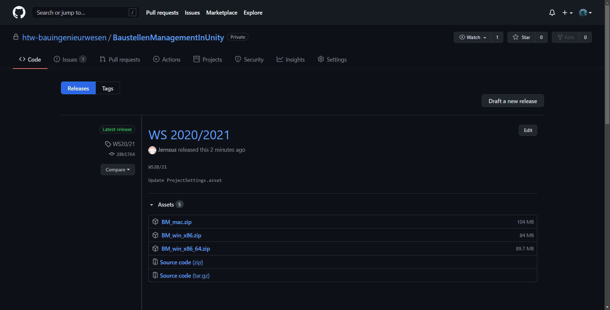

# **Navigation**  

* [Home](Home.md)  
* [Projektbeschreibung](Projektbeschreibung.md)  <!-- Passend zur Readme (gleich?) -->
* [Abschlussprotokoll](Abschlussprotokoll.md)

**[Anwender](Anwender.md)**  <!-- Unterscheidung der Doku zwischen Anw und Dev -->
* [Getting Started](GettingStartedUser.md)
* [Hauptmenü](Hauptmenü.md)  
* [Baustelle](Baustelle.md)  
  * [Bewegen der Kamera](Bewegen-der-Kamera.md)
  * [Objekte platzieren](Objekte-platzieren.md)
  * [Objekte verändern](Objekte-verändern.md)
  * [Visualisieren](Fahrzeugdaten-visualisieren.md)
  * [Polieransicht](Polieransicht.md)
* [Speichern/Laden](Speichern-und-Laden.md)
* [Modelle importieren](Modelle-importieren.md)
* [Tastenkürzel](Tastenkürzel.md)
* [GitHub](Github.md)

***

**[Entwickler](Entwickler.md)**  
* [Getting Started](GettingStartedDev.md)
* [Prefabs hinzufügen](Prefabs-hinzufügen.md)
* [Overview](Overview.md)
* [Betrachter Anwendung](Betrachter-Anwendung.md)
* [Anwendung bauen](Anwendung-bauen.md)
* Visualisierung   
  * [Datenbank](Datenbank.md)
  * [DataInterface](DataInterface.md)

# Anleitung zum erstmaligen herunterladen und starten der Anwendung
Dieser Guide soll beim schnellen Einstieg in die Anwendung helfen. Es werden alle Schritte vom herunterladen und starten der Anwendung bishin zur Verwendung gezeigt und beschrieben.

## 1. Herunterladen des Projektes
Um das Projekt auf einem neuen Rechner zu installieren muss lediglich das Release `Latest Release` aus dem Github heruntergeladen werden.
Das Release ist auf dem Github [htw-bauingenieurwesen](https://github.com/htw-bauingenieurwesen/BaustellenManagementInUnity/releases/) zu finden.
Dabei ist zu beachten, dass man die passende Version für sein Betriebssystem auswählt. Zur Verfügung stehen Windows 32Bit, Windows 64Bit sowie eine Version für MacOS. 

 

Die heruntergeladene .zip-Datei kann anschließend an einem beliebigen Ort abgelegt und entpackt werden.

## Starten der Anwendung 
Um die Anwendung zu starten muss die `BaustellenManagement.exe` ausgeführt werden. Diese befindet sich in dem im vorherigen Schritt entpackten Ordner.
Die Anwendung startet automatisch in einem 1024x768 großen Fenster. Die Größe der Anwendung lässt sich durch ziehen am Rand variable vergrößern und verkleinern. Man kann sie ebenfalls über die Windowleiste am oberen Rand in die Taskleiste verkleinern oder auf Fullscreen vergrößern.