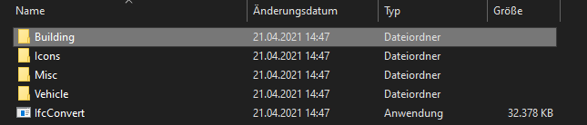

# **Navigation**  

* [Home](Home.md)  
* [Projektbeschreibung](Projektbeschreibung.md)  <!-- Passend zur Readme (gleich?) -->
* [Abschlussprotokoll](Abschlussprotokoll.md)

**[Anwender](Anwender.md)**  <!-- Unterscheidung der Doku zwischen Anw und Dev -->
* [Getting Started](GettingStartedUser.md)
* [Hauptmenü](Hauptmenü.md)  
* [Baustelle](Baustelle.md)  
  * [Bewegen der Kamera](Bewegen-der-Kamera.md)
  * [Objekte platzieren](Objekte-platzieren.md)
  * [Objekte verändern](Objekte-verändern.md)
  * [Visualisieren](Fahrzeugdaten-visualisieren.md)
  * [Polieransicht](Polieransicht.md)
* [Speichern/Laden](Speichern-und-Laden.md)
* [Modelle importieren](Modelle-importieren.md)
* [Tastenkürzel](Tastenkürzel.md)
* [GitHub](Github.md)

***

**[Entwickler](Entwickler.md)**  
* [Getting Started](GettingStartedDev.md)
* [Prefabs hinzufügen](Prefabs-hinzufügen.md)
* [Overview](Overview.md)
* [Betrachter Anwendung](Betrachter-Anwendung.md)
* [Anwendung bauen](Anwendung-bauen.md)
* Visualisierung   
  * [Datenbank](Datenbank.md)
  * [DataInterface](DataInterface.md)

# Modelle Importieren
Die Anwendung unterstützt zwei Arten von Importen. Den Runtime-Import und den Import durch den Unity Editor. 
Für den Anwender ist jedoch nur der Runtime-Import relevant. Für mehr Information: [Prefabs hinzufügen Entwickler](Prefabs-hinzufügen.md)

## Runtime Import IFC
Um nun eine `.ifc` Datei in die Anwendung importieren zu können, muss diese in einen Ordner(`Building/Misc/Vehicle`) unter `ImportIFC` gezogen werden. Dieser Ordner befindet sich in dem Hauptverzeichnis der Anwendung auf dem PC. 

Beim nächsten Start der Anwendung oder beim Laden einer neuen Baustelle, wird nun der Runtime-Import angestoßen. Alle Datein die sich in den Ordnern (`Building/Misc/Vehicle`) unter `ImportIFC` befinden werden nun in die laufende Anwendung importiert und können in der Benutzeroberfläche verwendet werden. Dieser Vorgang kann je nach Computer einige Zeit dauern.  

## Icons importieren
Icons werden zur Zeit nur beim Import über den Unity-Editor automatisch generiert und hinzugefügt. Um diese Funktion auch beim Runtime-Import verwenden zu können, muss zuvor ein Icon unter `ImportIFC/Icons` mit dem gleichen Namen abgelegt werden. Nehmen wir an, wir legen beim Importieren eine Datei mit dem Namen `showcase.ifc` unter `ImportIFC/Buildings` ab und möchten diese importieren. Das Icon muss dementsprechend `showcase.png` heißen und unter `ImportIFC/Icons` abgelegt werden, damit der Importer diese erkennt. 
`Achtung: Icon muss .png sein!`

## Speichern/Laden
Es besteht die Möglichkeit, dass im Speicherstand Modelle vorhanden sind, die aktuell nicht importiert sind. Die Hinweise auf der Seite [Speichern und Laden](Speichern-und-Laden.md) sind zu beachten.

## Importieren von mehreren Modellen
Der Import von mehreren Modellen gleichzeitig ist auch möglich. Hierzu makieren wir mehrere `.ifc` Dateien und folgen den oben genannten Schritten.
