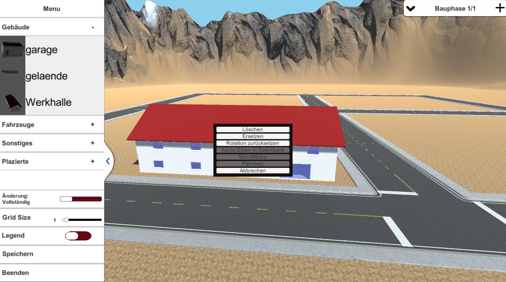
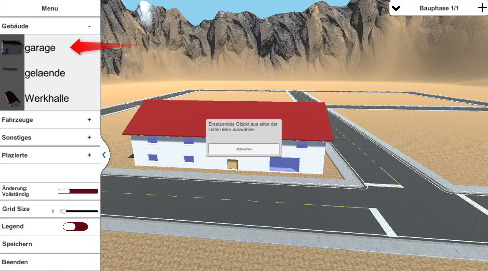
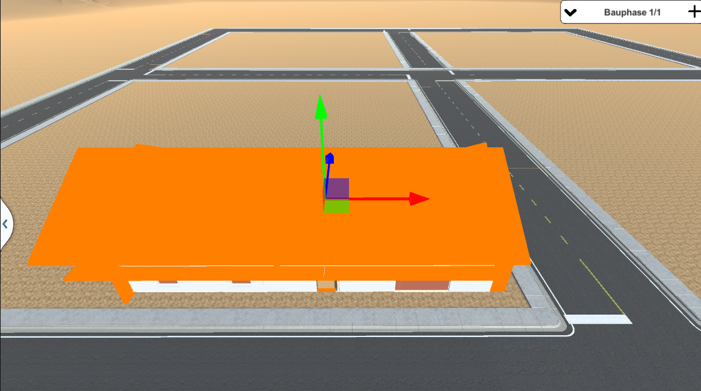
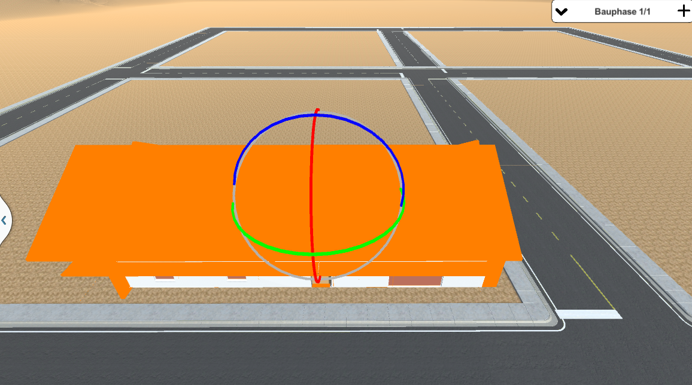
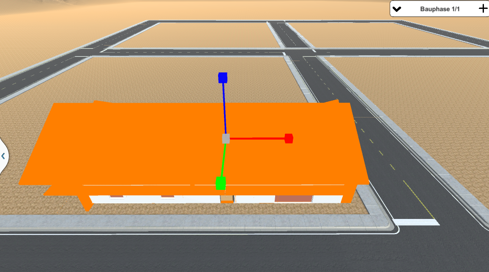

# **Navigation**  

* [Home](Home.md)  
* [Projektbeschreibung](Projektbeschreibung.md)  <!-- Passend zur Readme (gleich?) -->
* [Abschlussprotokoll](Abschlussprotokoll.md)

**[Anwender](Anwender.md)**  <!-- Unterscheidung der Doku zwischen Anw und Dev -->
* [Getting Started](GettingStartedUser.md)
* [Hauptmenü](Hauptmenü.md)  
* [Baustelle](Baustelle.md)  
  * [Bewegen der Kamera](Bewegen-der-Kamera.md)
  * [Objekte platzieren](Objekte-platzieren.md)
  * [Objekte verändern](Objekte-verändern.md)
  * [Visualisieren](Fahrzeugdaten-visualisieren.md)
  * [Polieransicht](Polieransicht.md)
* [Speichern/Laden](Speichern-und-Laden.md)
* [Modelle importieren](Modelle-importieren.md)
* [Tastenkürzel](Tastenkürzel.md)
* [GitHub](Github.md)

***

**[Entwickler](Entwickler.md)**  
* [Getting Started](GettingStartedDev.md)
* [Prefabs hinzufügen](Prefabs-hinzufügen.md)
* [Overview](Overview.md)
* [Betrachter Anwendung](Betrachter-Anwendung.md)
* [Anwendung bauen](Anwendung-bauen.md)
* Visualisierung   
  * [Datenbank](Datenbank.md)
  * [DataInterface](DataInterface.md)

# Objekte verändern/bewegen

Die Anwendung bietet die Möglichkeit, platzierte Objekte zu verändern. Ob und wie die Änderungen in andere Phasen übernommen werden, hängt von dem eingestellten Modus ab (siehe [Baustelle -> Menü](Baustelle.md)).

## Objekte mittels Kontextmenü verändern
Durch einen Rechtsklick auf das Objekt oder auf das Listenelement aus dem *Platziert-Tab* wird ein Kontextmenü geöffnet, das es ermöglicht Objekte 
* zu löschen
* zu ersetzen oder
* deren Rotation zurückzusetzen.

Um ein Objekt zu ersetzen, muss zuerst das Kontextmenü eines Objektes mit einem Rechtsklick geöffnet und auf *Ersetzen* gedrückt werden. Anschließend muss das neue Objekt, welches das gewählte ersetzen soll, aus einer der vier Objektlisten in der Objektübersicht ausgewählt werden.

## Objekte mittels Linksklick verändern
Wählt man ein Objekt mittels Linksklick aus, kann man es entweder verschieben (1), rotieren(2) oder skalieren(3) (siehe [Tastenkürzel](Tastenkürzel.md)). Die Optionen werden unterschiedlich visualisert:
### Verschieben:

### Rotieren:

### Skalieren:

