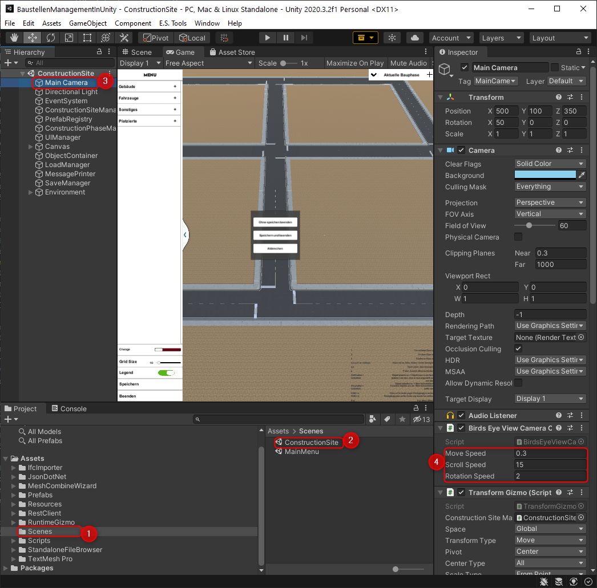

# **Navigation**  

* [Home](Home.md)  
* [Projektbeschreibung](Projektbeschreibung.md)  <!-- Passend zur Readme (gleich?) -->
* [Abschlussprotokoll](Abschlussprotokoll.md)

**[Anwender](Anwender.md)**  <!-- Unterscheidung der Doku zwischen Anw und Dev -->
* [Getting Started](GettingStartedUser.md)
* [Hauptmenü](Hauptmenü.md)  
* [Baustelle](Baustelle.md)  
  * [Bewegen der Kamera](Bewegen-der-Kamera.md)
  * [Objekte platzieren](Objekte-platzieren.md)
  * [Objekte verändern](Objekte-verändern.md)
  * [Visualisieren](Fahrzeugdaten-visualisieren.md)
  * [Polieransicht](Polieransicht.md)
* [Speichern/Laden](Speichern-und-Laden.md)
* [Modelle importieren](Modelle-importieren.md)
* [Tastenkürzel](Tastenkürzel.md)
* [GitHub](Github.md)

***

**[Entwickler](Entwickler.md)**  
* [Getting Started](GettingStartedDev.md)
* [Prefabs hinzufügen](Prefabs-hinzufügen.md)
* [Overview](Overview.md)
* [Betrachter Anwendung](Betrachter-Anwendung.md)
* [Anwendung bauen](Anwendung-bauen.md)
* Visualisierung   
  * [Datenbank](Datenbank.md)
  * [DataInterface](DataInterface.md)

# Dateien Overview
* Database
  * Alle Scripts und Anbindungen an die Firebase DB
* PrefabClasses
  * Alle Scripts die zur Darstellungen und Bewegung der einzelnen Objekte benötigt wird 
* SaveAndLoad
  * Scripts zur Steuerung der Lade/Speicher Mechanismen
* UI
  * Scripts zur Initialisierung und Verwaltung der UI Elemente
* Views
  * Scripts zur Definition und Einstellung der Views

# Wichtige Inhalte
## Scripts Allgemein
### BsmuSceneManager
* Steuert den Scene-Loading-Machanism 
* Wird verwendet um die Scene zu wechseln
### ConstructionPhasesManager
* Steuert das Hinzufügen und Managen aller aktuellen und kommenden Phasen
### ConstructionSiteManager
* Hilfsfunktionen zur Steuerung der ConstructionPhase
  
## Scripts UI
### ConstructionSiteUIManager
* Steuert alle UI Elemente der Construction Site
* kümmert sich um die Updates so wie Initalisierung
### MainMenuUIManager
* Steuert alle Main Menu UI Elemente

## Scripts PrefabClasses
### ObjectData
* Speichert wichtige Daten der Ursprünglichen Prefabs
### PrefabContainer
* Beinhaltet nach Initialisierung alle importierten Prefab Dateien

## IFC-Importer
* Icons werden im IFC-Importer unter IfcImporter/Editor/PrefabSaver.cs erstellt.
* Erstellung, Bearbeitung und Löschung der .prefab/.ifc Dateien ist unter IfcImporter/Scripts/IfcImporter.cs zu finden.
* Die Collider der Objekte werden unter IfcImporter/Scripts/IfcXmlParser.cs auf convex gestellt und hinzugefügt.
* Der IfcImporter liegt auf dem Unity Account von Herrn Dominik Gorski. Wenn Update benötigt, bitte an ihn wenden. 

# Ändern der Kamera Einstellungen
Um die Bewegungsgeschwindigkeit der Kamera sowie des Polierers zu ändern muss man die Anwendung im UnityEditor öffnen. Anschließend öffnet man zuerste unter 1.`Scenes`(1) die Scene `ConstructionSite`(2) und öffnet das Kontextmenü der Kamera `Main Camera`(3). Im Kontextmenü kann man nun unter der `Birds Eye View Camera Controller`(4) die Einstellungen `Move Speed`, `Scroll Speed`, `Rotation Speed` beliebig anpassen.  

# Dokumentation 
Die Dokumentation ist in Markdown geschrieben. Hierzu wurde das VisualStudioCode Plugin `Markdown All in One` verwendet. Dieses Plugin stellt sämtliche Templates und Auto-Complete sowie eine Konvertierung von `.md` zu `.html` zur Verfügung.

## Hinweis
Zur leichteren Konvertierung kann auch das Programm `Pandoc` verwendet werden. Ansonsten müssen in der `.html`-Datei die Links zu den einzelnen Bildern angepasst werden, da die sonst auf das lokale FileSystem zeigen.