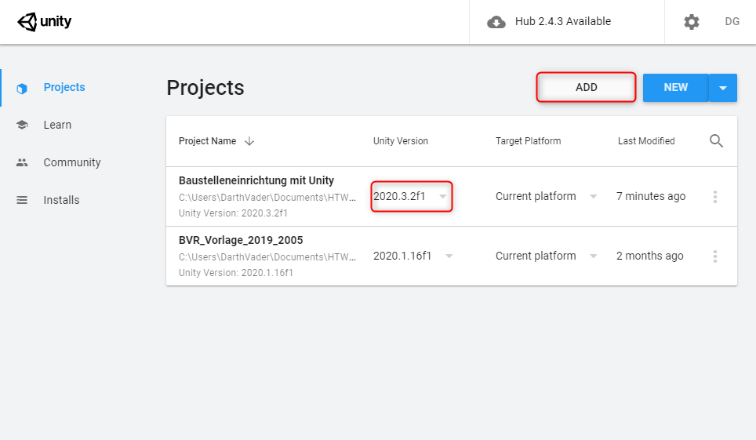

# **Navigation**  

* [Home](Home.md)  
* [Projektbeschreibung](Projektbeschreibung.md)  <!-- Passend zur Readme (gleich?) -->
* [Abschlussprotokoll](Abschlussprotokoll.md)

**[Anwender](Anwender.md)**  <!-- Unterscheidung der Doku zwischen Anw und Dev -->
* [Getting Started](GettingStartedUser.md)
* [Hauptmenü](Hauptmenü.md)  
* [Baustelle](Baustelle.md)  
  * [Bewegen der Kamera](Bewegen-der-Kamera.md)
  * [Objekte platzieren](Objekte-platzieren.md)
  * [Objekte verändern](Objekte-verändern.md)
  * [Visualisieren](Fahrzeugdaten-visualisieren.md)
  * [Polieransicht](Polieransicht.md)
* [Speichern/Laden](Speichern-und-Laden.md)
* [Modelle importieren](Modelle-importieren.md)
* [Tastenkürzel](Tastenkürzel.md)
* [GitHub](Github.md)

***

**[Entwickler](Entwickler.md)**  
* [Getting Started](GettingStartedDev.md)
* [Prefabs hinzufügen](Prefabs-hinzufügen.md)
* [Overview](Overview.md)
* [Betrachter Anwendung](Betrachter-Anwendung.md)
* [Anwendung bauen](Anwendung-bauen.md)
* Visualisierung   
  * [Datenbank](Datenbank.md)
  * [DataInterface](DataInterface.md)

# Prefabs Hinzufügen
* Runtime Import
* Unity-Editor Import zum erweitern der Standard Bib
# Erweitern der Standardbibliothek:
1. Um neue Modelle in die Anwendung zu importieren muss das Projekt mit dem Unity-Editor(`2020.3.2f1`) geöffnet werden.
   

  

1. Anschließend muss das Modell als `.ifc` Datei in den Ordner `/Resources/Prefabs` per Drag & Drop gezogen werden. 

Die Anwendung konvertiert die `.ifc` Datei und erstellt eine `.xml`, `.dae` unter `/Resources` sowie eine .prefab Datei in `/Resources/Prefabs` und erstellt automatisch eine Icons Datei. 

3. Die `.prefab` Datei muss danach in einen der Ordner Building, Misc oder Vehicle gezogen werden.

4. Um die Änderungen nun zu vervollständigen, muss das Projekt neu gebaut werden. Dazu klickt man unter `File -> Build Settings -> Build`.

Die Änderungen sollten danach ebenfalls auf GitHub gepusht werden damit anderen Studierende die Modelle verwenden können. Siehe Hierzu [GitHub](Github.md)

1. Dieses Build kann nun als Release auf dem Github veröffentlich werden. Die neu hinzugefügten Objekte sind nun im Build vorhanden und können von jedem verwendet werden.

## Speichern/Laden
Es besteht die Möglichkeit, dass im Speicherstand Modelle vorhanden sind, die aktuell nicht importiert sind. Die Hinweise auf der Seite [Speichern und Laden](Speichern-und-Laden.md) sind zu beachten.

## Importieren von mehreren Modellen
Der Import von mehreren Modellen gleichzeitig ist auch möglich. Hierzu makieren wir mehrere `.ifc` Dateien und folgen den oben genannten Schritten.

# Runtime Import Hinweise
Die Funktionsweise des Runtime-Imports wird unter `Assets/IfcImporter/Demo` gezeigt und beschrieben.
Mehr Informationen zum Importer unter [AssetStore IfcImporter](https://assetstore.unity.com/packages/tools/utilities/ifc-importer-162502)

# Hinweis
Wenn Objekte nach dem platzieren versetzt sind, muss man in der .prefab Datei die Koordinaten überprüfen. Diese sollten sich, in der Regel, in der nähe von `0/0/0` befinden. Wenn die zu verarbeitende `.ifc` Datei fehlerhafte Koordinaten enthalten sollte, werden diese in die `.prefab` Datei und somit in die Anwendung übernommen. Deshalb schaut bei solchen Fehler auch in der Original-Datei(`.ifc`) nach.

